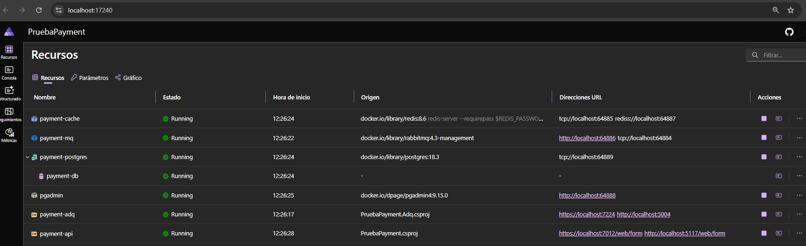
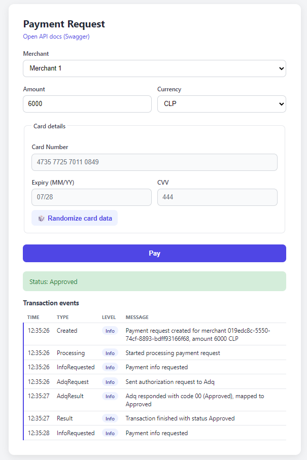

# PruebaPayment

Prueba técnica que implementa una API de pagos en .NET. Simula el flujo de una pasarela de pagos: recibe una solicitud de pago, la persiste, la envía a un adquirente (acquirer) externo para autorización y publica un evento cuando el pago es creado, registrando además el historial de eventos de la transacción.

El proyecto está armado con **.NET Aspire**, por lo que para levantarlo localmente es necesario tener instalado el [workload de Aspire](https://learn.microsoft.com/dotnet/aspire/fundamentals/setup-tooling) (y Docker corriendo, ya que Aspire orquesta los contenedores de las dependencias).

## Arquitectura

En la carpeta [`Docs`](Docs) hay un diagrama hecho en draw.io (`Prueba payment.drawio`) con el detalle de los flujos, y una imagen (`Prueba payment.drawio.png`) con la vista general de la arquitectura:

## Proyectos de la solución

- **PruebaPayment.AppHost**: proyecto host de Aspire. Orquesta y levanta todas las dependencias (Postgres, RabbitMQ, Redis) y los proyectos de la solución, conectándolos entre sí.
- **PruebaPayment**: la API principal. Expone los endpoints de pagos, merchants y eventos de transacción, persiste en Postgres, publica eventos en RabbitMQ y consume el adquirente externo.
- **PruebaPayment.Adq**: API que **simula un adquirente externo** (ADQ) tipo ISO 8583. Expone un endpoint `/authorize` que de forma aleatoria aprueba, rechaza o falla la transacción (errores 5xx, timeouts simulados, errores 4xx), pensado para poder ejercitar el pipeline de resiliencia (retries, timeout y circuit breaker) del cliente HTTP que la consume.
- **PruebaPayment.ServiceDefaults**: configuración común de Aspire (telemetría, health checks, service discovery) compartida entre los proyectos.

## Dependencias

- **PostgreSQL**: base de datos principal de la API, donde se persisten merchants, solicitudes de pago y eventos de transacción.
- **Redis**: usado como cache.
- **RabbitMQ**: mensajería para publicar el evento de pago creado y procesarlo de forma asíncrona.
- **ADQ simulado** (`PruebaPayment.Adq`): hace de adquirente externo al que la API le pide la autorización de cada pago.

Todas estas dependencias son provisionadas y conectadas automáticamente por el AppHost de Aspire (no es necesario instalarlas ni configurarlas a mano).

## Cómo correr el proyecto

1. Tener instalado el SDK de .NET, el workload/CLI de Aspire y Docker.
2. Ejecutar (o iniciar debug de) el proyecto **PruebaPayment.AppHost**.
3. Aspire va a levantar los contenedores de Postgres, RabbitMQ y Redis, y luego la API y el ADQ simulado, conectando todo mediante service discovery.
4. Al iniciar, se abre automáticamente el **Aspire Dashboard** en el navegador.

## Aspire Dashboard

El Aspire Dashboard es la consola web que provee .NET Aspire para observar la aplicación distribuida mientras corre localmente: lista todos los recursos (Postgres, pgAdmin, RabbitMQ, Redis, `payment-api`, `payment-adq`) con su estado, variables de entorno y endpoints, y permite ver sus logs, traces y métricas en un solo lugar.

La primera vez que se abre, hay que esperar a que todos los recursos pasen a estado **Running** (Postgres y RabbitMQ tardan un poco más porque son contenedores). Una vez arriba, hay que entrar al recurso **payment-api** y abrir alguna de sus URLs en la columna "Direcciones URL": como los puertos se asignan dinámicamente, esas son las URLs reales donde quedó publicada la API en esta ejecución (en el ejemplo de la imagen, ya apuntan directo a `/web/form`). Desde ahí se puede navegar al formulario web o a Swagger.

## Documentación de la API (Swagger)

La API expone **Swagger** en `/swagger`, con todos los endpoints documentados (pagos, merchants, eventos de transacción) y soporte para autenticación Bearer/JWT, para poder probarlos directamente desde ahí.

## Formulario web de prueba

Para no depender únicamente de Swagger, la API también expone un formulario de prueba en `/web/form`, pensado para simular cómo un usuario final generaría un pago:

Lo que hace el formulario:

1. Al cargar, consulta `GET /merchants` y llena el combo de **Merchant** (los merchants inactivos aparecen deshabilitados).
2. Los datos de **tarjeta** (número, vencimiento, CVV) no se tipean: se generan automáticamente con el botón "🎲 Randomize card data" (el número de tarjeta se genera respetando el algoritmo de Luhn).
3. Al enviar el formulario, se hace `POST /payments` con un `idempotencyKey` único, el merchant, el monto/moneda y los datos de la tarjeta.
4. Mientras la solicitud está en curso, el formulario hace *polling* a `GET /payments/{id}` cada 2 segundos hasta que el pago llega a un estado terminal (`Approved`, `Declined` o `Failed`), mostrando el estado actual.
5. Una vez terminado, consulta `GET /payments/{id}/events` y muestra la tabla de **eventos de la transacción** (el historial de lo que fue pasando con ese pago: intentos al ADQ, reintentos, resultado, etc.).

## Migraciones y mensajería

- La base de datos **migra sola**: al iniciar la API se ejecuta `context.Database.Migrate()`, por lo que las migraciones de Entity Framework se aplican automáticamente contra Postgres sin pasos manuales.
- Los **exchanges y colas de RabbitMQ también se crean solos**: al iniciar la API se declaran el exchange `payment.events`, la cola `payment.created.queue` (con su binding) y la cola de dead letter `payment.created.queue.dlq`.

## Secretos y configuración

Los secretos (JWT, clave de cifrado de tarjetas, etc.) están definidos directamente en los `appsettings.json` del repositorio. Esto se hace únicamente porque es una **prueba técnica** y facilita correr el proyecto sin pasos adicionales.

En un repositorio real estos valores **no deberían** estar en el código: los `appsettings` deberían ir vacíos (o con placeholders) y los secretos deberían manejarse con un *secret manager* (por ejemplo, User Secrets en desarrollo, o un Key Vault/Secrets Manager en los demás ambientes).
